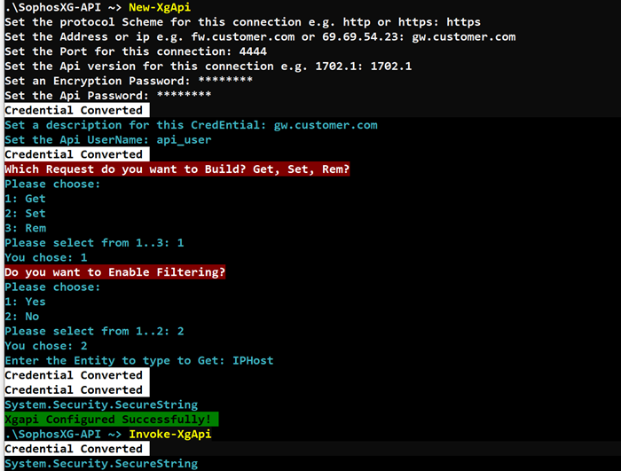

# SophosXG-API

## A powershell module written for use with Sophos XG Firewalls

This is my **first** for everything code (publicly) so please _flame_ me

## Todo

- [x] Inital Build
- [x] Test generating commands and invoking
- [x] Populate readme (sort of)
- [ ] Add postgre portable or sql db for storage
- [ ] Write functions for sql storage and return
- [ ] Build out the xml classes (reuse the Sophos perl ones)

## To Start ~>

```powershell
Import-Module XgApi.psd1
New-XgApi
Invoke-XgApi
Show-XgApi -Response -Expand
```

<!-- .element height="25%" width="25%" -->

## Module Commands

```s
CommandType     Name                                               Version    Source
-----------     ----                                               -------    ------
Alias           Rem-XgApi                                          1.0.0.0    XgApi
Alias           Rem-XgCredential                                   1.0.0.0    XgApi
Function        Clear-XgApi                                        1.0.0.0    XgApi
Function        Get-XgApi                                          1.0.0.0    XgApi
Function        Get-XgApiFilter                                    1.0.0.0    XgApi
Function        Get-XgCredential                                   1.0.0.0    XgApi
Function        Invoke-XgApi                                       1.0.0.0    XgApi
Function        New-XgApi                                          1.0.0.0    XgApi
Function        Remove-XgApi                                       1.0.0.0    XgApi
Function        Remove-XgCredential                                1.0.0.0    XgApi
Function        Set-XgApi                                          1.0.0.0    XgApi
Function        Set-XgCredential                                   1.0.0.0    XgApi
Function        Show-XgApi                                         1.0.0.0    XgApi
```

## New-XgApi creates a new [xg] object and populates the values

### This needs to be run first before any other commands

```powershell
New-XgApi [-Prompt] [<CommonParameters>]

New-XgApi [[-xgapi] <Xg>] [<CommonParameters>]

New-XgApi [[-api] <Api>] [<CommonParameters>]

New-XgApi [[-object] <psobject>] [<CommonParameters>]

New-XgApi [-test] [<CommonParameters>]

New-XgApi [-out_object] [<CommonParameters>]
```

### If you would rather interact with an object

```powershell
$myvar = new-xgapi -out_object
$myvar.fill()
$myvar.api.build()
$myvar.request()
$myvar.invoke()
$myvar.api.invoke()
$myvar.api.uri
```

### or use the global variable \$xg.api

```s
Name        MemberType Definition
----        ---------- ----------
Build       Method     void Build(), void Build(Api_Build Build), void Build(Build b), void Build(Api Api)
Clear       Method     void Clear()
Equals      Method     bool Equals(System.Object obj)
GetHashCode Method     int GetHashCode()
Invoke      Method     string Invoke(), string Invoke(Api Api)
Test        Method     void Test()
ToString    Method     string ToString()
url         Method     void url(), void url(Api Api), void url(Api_Build Api), void url(XgApiCall type), void url(XgUri Uri, securestring login, System.Object query)
Cred        Property   XgCred Cred {get;set;}
Filter      Property   XgFilter Filter {get;set;}
Lasttype    Property   XgApiCall Lasttype {get;set;}
Rem         Property   XgRem Rem {get;set;}
Request     Property   securestring Request {get;set;}
Response    Property   System.Object Response {get;set;}
Set         Property   XgSet Set {get;set;}
Uri         Property   XgUri Uri {get;set;}
```

## Get-XgApi configures the comands to send get requests

```powershell
Get-XgApi [-Prompt] [-Show] [<CommonParameters>]

Get-XgApi [[-entity] <XgEntities>] [-Show] [<CommonParameters>]

Get-XgApi [[-build] <XgGet>] [-Show] [<CommonParameters>]

Get-XgApi [[-xgapi] <Xg>] [-Show] [<CommonParameters>]

Get-XgApi [[-api] <Api>] [-Show] [<CommonParameters>]

Get-XgApi [-test] [-Show] [<CommonParameters>]

Get-XgApi [-out_object] [-Show] [<CommonParameters>]
```

## Get-XgApiFilter configures the comands to send get requests with filtering

```powershell
Get-XgApiFilter [-Prompt] [-Show] [<CommonParameters>]

Get-XgApiFilter [[-entity] <XgEntities>] [-Show] [<CommonParameters>]

Get-XgApiFilter [[-build] <XgFilter>] [-Show] [<CommonParameters>]

Get-XgApiFilter [[-xgapi] <Xg>] [-Show] [<CommonParameters>]

Get-XgApiFilter [[-api] <Api>] [-Show] [<CommonParameters>]

Get-XgApiFilter [-test] [-Show] [<CommonParameters>]

Get-XgApiFilter [-out_object] [-Show] [<CommonParameters>]
```

## Set-XgApi configures the comands to send set requests

```powershell
Set-XgApi [-Prompt] [-Show] [<CommonParameters>]

Set-XgApi [[-entity] <XgEntities>] [-Show] [<CommonParameters>]

Set-XgApi [[-build] <XgSet>] [-Show] [<CommonParameters>]

Set-XgApi [[-xgapi] <Xg>] [-Show] [<CommonParameters>]

Set-XgApi [[-api] <Api>] [-Show] [<CommonParameters>]

Set-XgApi [-test] [-Show] [<CommonParameters>]

Set-XgApi [-out_object] [-Show] [<CommonParameters>]
```

## Remove-XgApi configures the comands to send remove requests

```powershell
Remove-XgApi [-Prompt] [-Show] [<CommonParameters>]

Remove-XgApi [[-entity] <XgEntities>] [-Show] [<CommonParameters>]

Remove-XgApi [[-build] <XgGet>] [-Show] [<CommonParameters>]

Remove-XgApi [[-xgapi] <Xg>] [-Show] [<CommonParameters>]

Remove-XgApi [[-api] <Api>] [-Show] [<CommonParameters>]

Remove-XgApi [-test] [-Show] [<CommonParameters>]

Remove-XgApi [-out_object] [-Show] [<CommonParameters>]
```

## Show-XgApi shows the values stored in the modules object

```powershell
Show-XgApi [-All] [-AsPlainText] [<CommonParameters>]

Show-XgApi [-Uri] [<CommonParameters>]

Show-XgApi [-Cred] [<CommonParameters>]

Show-XgApi [-Get] [<CommonParameters>]

Show-XgApi [-Set] [<CommonParameters>]

Show-XgApi [-Rem] [<CommonParameters>]

Show-XgApi [-Filter] [<CommonParameters>]

Show-XgApi [-Request] [-AsPlainText] [<CommonParameters>]

Show-XgApi [-Response] [-Expand] [<CommonParameters>]

Show-XgApi [-Response] [<CommonParameters>]
```

## Clear-XgApi clears the values stored in the modules object

```powershell
Clear-XgApi
```

## Invoke-XgApi sends the request to the device to process

```powershell
Invoke-XgApi [-default] [-Expand] [<CommonParameters>]

Invoke-XgApi [-Prompt] [-Expand] [<CommonParameters>]

Invoke-XgApi [[-xgapi] <Xg>] [-Expand] [<CommonParameters>]

Invoke-XgApi [[-api] <Api>] [-Expand] [<CommonParameters>]

Invoke-XgApi [-get] [-Expand] [<CommonParameters>]

Invoke-XgApi [-set] [-Expand] [<CommonParameters>]

Invoke-XgApi [-rem] [-Expand] [<CommonParameters>]

Invoke-XgApi [-filter] [-Expand] [<CommonParameters>]

Invoke-XgApi [-show] [-Expand] [<CommonParameters>]
```

## Get-XgCredential gets a stored credential from the credential store

```powershell
Get-XgCredential -Search [<CommonParameters>]

Get-XgCredential [-Cred] <XgCred> [<CommonParameters>]

Get-XgCredential [-api] <Api> [<CommonParameters>]

Get-XgCredential [-xg] <Xg> [<CommonParameters>]
```

## Set-XgCredential saves/updates a credential in the credential store

```powershell
Set-XgCredential -Search [<CommonParameters>]

Set-XgCredential [-Cred] <XgCred> [<CommonParameters>]

Set-XgCredential [-api] <Api> [<CommonParameters>]

Set-XgCredential [-xg] <Xg> [<CommonParameters>]
```

## Remove-XgCredential remove a credential from the credential store

```powershell
Remove-XgCredential -Search [<CommonParameters>]

Remove-XgCredential [-Cred] <XgCred> [<CommonParameters>]

Remove-XgCredential [-api] <Api> [<CommonParameters>]

Remove-XgCredential [-xg] <Xg> [<CommonParameters>]
```

### Written using Powershell 5.1

```s
Name                           Value
----                           -----
PSVersion                      5.1.18362.145
PSEdition                      Desktop
PSCompatibleVersions           {1.0, 2.0, 3.0, 4.0...}
BuildVersion                   10.0.18362.145
CLRVersion                     4.0.30319.42000
WSManStackVersion              3.0
PSRemotingProtocolVersion      2.3
SerializationVersion           1.1.0.1
```
